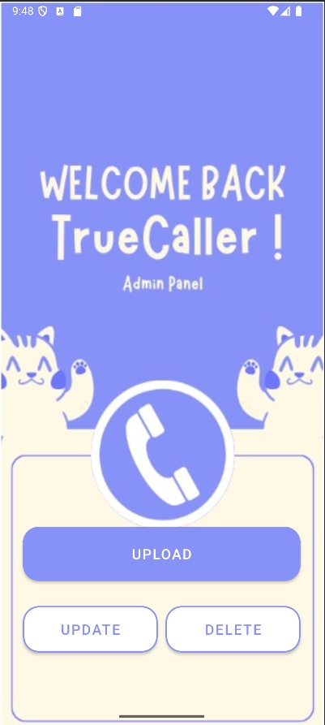
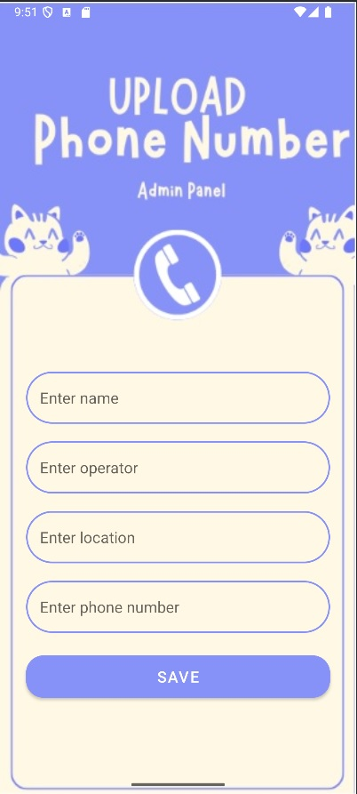
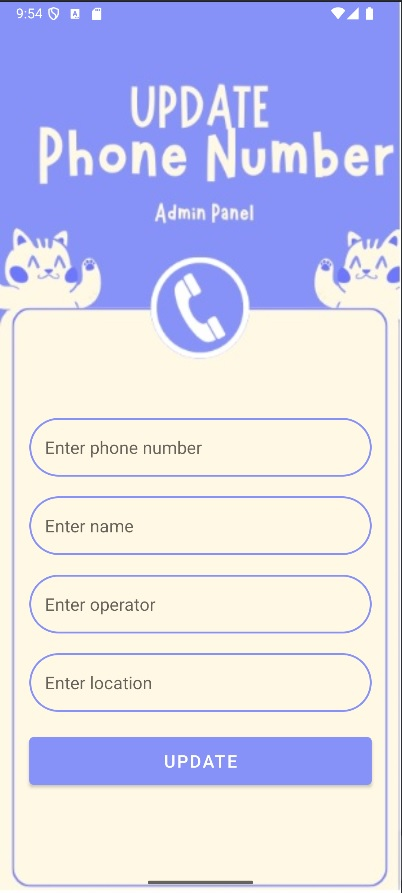
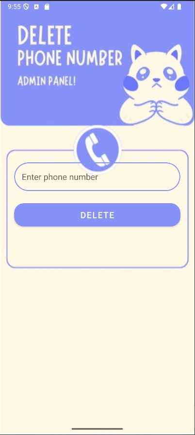

# CRUD ADMIN
Este proyecto es un proyecto escolar para la materia de: Programación De Aplicaciones Para Dispositivos Móviles. Para el Ing: Amado López Hilario.

### Imagen: Pantalla de bienvenido.

### Imagen: Pantalla de consulta.

### Imagen: Pantalla de insertado de datos.

### Imagen: Pantalla de actualización de datos.

### Imagen: Pantalla de eliminación de datos.

### Video de funcionamiento:
[![video][Video de funcionamiento]](Funcionamiento.WEBM)
